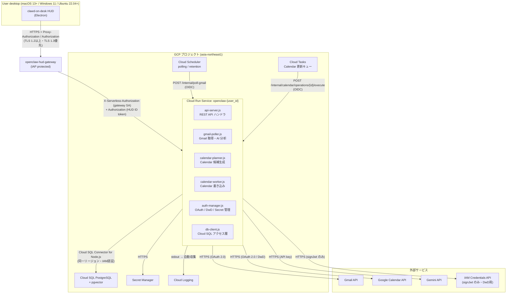

# インフラアーキテクチャ設計書: MASTERkey AI秘書（OpenClaw）

作成日: 2026-06-02 | 改訂日: 2026-06-04 | バージョン: 1.4 | ステータス: DRAFT
依拠要件: requirements_definition.md v8.13

---

## 文書概要

本文書は OpenClaw + clawd-on-desk HUD のインフラ構成を定義する。GCP サービス構成・IAM 権限・通信フロー・監視・CI/CD 方針を記述する。IaC（Terraform 等）の詳細は別途 `package_structure_design.md` に記述する。

---

## 目的

- GCP リソースの全体像と責務分担を明確にする
- IAM 最小権限構成を文書化し、セキュリティ設計の入力とする
- Cloud Scheduler・Cloud Tasks の起動モデルを確定する
- 監視・ログ収集の方針を定義する

---

## 対象範囲

| コンポーネント | 種別 |
|---|---|
| OpenClaw | GCP Cloud Run（1ユーザー 1サービス） |
| Cloud SQL PostgreSQL | GCP Cloud SQL |
| Secret Manager | GCP Secret Manager |
| Cloud Scheduler | GCP Cloud Scheduler |
| Cloud Tasks | GCP Cloud Tasks |
| Cloud Logging | GCP Cloud Logging |
| HUD（clawd-on-desk）| macOS 13+ / Windows 11 / Linux (Ubuntu 22.04+) Electron アプリ |
| Gmail API / Google Calendar API | Google Workspace 外部 API |
| Gemini API | Google 外部 API |

---

## 前提

| # | 前提条件 |
|--|---|
| P-01 | MVP の GCP プロジェクトは 1ユーザー = 1プロジェクトで運用し、Cloud SQL も1ユーザー1インスタンスに固定する。1プロジェクト内の複数ユーザー収容・共有Cloud SQL・tenant_id/RLS は MVP 対象外 |
| P-02 | Cloud Run と Cloud SQL は同一 GCP リージョン（asia-northeast1 想定）に配置する |
| P-03 | Electron HUD は macOS 13+ / Windows 11 / Linux (Ubuntu 22.04+) 上で動作し、インターネット経由で Cloud Run に接続する |
| P-04 | IaC ツール（Terraform / gcloud CLI）は未確定。手動 gcloud CLI での初期設定を前提として記述する |

---

## 全体構成図



**図の前提**:
- HUD → OpenClaw の通信は IAP 保護された `openclaw-hud-gateway` 経由の HTTPS。`openclaw-api` は `--no-allow-unauthenticated` + `--ingress=all` を維持し、gateway SA / Scheduler SA / Tasks SA のみが Cloud Run `roles/run.invoker` を持つ。HUD 利用者や Workspace domain には direct invoker を付与しない（REQ-OPS-001）
- Cloud Scheduler / Cloud Tasks → Cloud Run は OIDC トークンを付与し、専用SAに Cloud Run `roles/run.invoker` を付与する。OpenClawアプリケーションも issuer / audience / service account email allowlist を検証する（OpenAPI schedulerOidcToken / cloudTasksOidcToken）
- Cloud Run → Cloud SQL は Cloud SQL Connector for Node.js（`@google-cloud/cloud-sql-connector`）経由（同一リージョン・IAM認証・サイドカー不要）

---

## 主要コンポーネント

### OpenClaw（Cloud Run）

| 項目 | 値 | 根拠 |
|---|---|---|
| サービス名 | `openclaw-{user_id}` | 1ユーザー 1サービス（REQ-OPS-001） |
| ingress | `all` + `--no-allow-unauthenticated` | `openclaw-api` は gateway SA / Scheduler SA / Tasks SA の Cloud Run IAM `roles/run.invoker` と OpenClawアプリケーション側 ID/OIDC token 検証で保護（REQ-OPS-001、C-07）|
| min-instances | `1` | コールドスタート回避（SLI-01） |
| max-instances | `1` | 1:1 モデル維持、ナレッジ混在防止 |
| concurrency | `1` | 1:1 モデル（REQ-OPS-003） |
| memory | `1GB` | pgvector 検索・AI SDK 動作（REQ-OPS-003） |
| CPU | `1.0 vCPU` | 同上 |
| リクエストタイムアウト | `120秒` | Cloud Tasks 実行時間を含む（REQ-OPS-003） |
| 実行サービスアカウント | `openclaw-sa@{project}.iam.gserviceaccount.com` | 下記 IAM 参照 |

### Cloud SQL PostgreSQL

| 項目 | 値 | 根拠 |
|---|---|---|
| バージョン | PostgreSQL 15 以上（pgvector 対応） | REQ-STORE-001 |
| インスタンスタイプ | `db-g1-small`（初期）| 約 20件/日の処理量に対応 |
| リージョン | Cloud Run と同一（asia-northeast1）| レイテンシ最小化（REQ-STORE-001） |
| 自動バックアップ | 有効（7日保持）| REQ-STORE-001 |
| パブリック IP | 無効（プライベート IP のみ）| Cloud Run 同一 VPC 接続 |
| 接続 | Cloud SQL Connector for Node.js（`@google-cloud/cloud-sql-connector`）。サイドカー不要・IAM認証 | OQ-INFRA-005 CLOSED |
| 最大接続数プール | 10 コネクション | REQ-STORE-001 |

### Cloud Run 環境変数

Gateway/backend handoff の app auth 検証に必要な非シークレット設定値を環境変数として配置する。これらは Secret Manager ではなく `--set-env-vars` で設定する（非シークレットのため）。

| 環境変数名 | 設定値 | 用途 |
|---|---|---|
| `GOOGLE_CLIENT_ID` | OAuth client ID（credentials.json の `client_id`）例: `1234567890-xxxx.apps.googleusercontent.com` | Gateway/backend handoff の Google ID token `aud` クレーム検証に使用。**Cloud Run サービス URL ではない**（app auth ID token の `aud` は OAuth client ID）。UA-001解消済み（2026-06-07） |
| `ALLOWED_DOMAIN` | 組織ドメイン（例: `company.com`） | HUD ユーザーの ID token `hd`（hosted domain）クレーム検証に使用 |
| `ALLOWED_SUBJECT` | 許可する Google user `sub` | MVP必須。1ユーザー1Cloud Runの認可境界として、同一ドメイン内の別ユーザーを403で拒否するために使用 |
| `SCHEDULER_SERVICE_ACCOUNT_EMAIL` | Cloud Scheduler OIDC 発行元 SA（例: `openclaw-scheduler-invoker@project.iam.gserviceaccount.com`） | `/internal/poll-gmail`・`/internal/retention/pii-mask` の OIDC token email allowlist 検証に使用。Cloud Run 実行SAとは分離する |
| `TASKS_SERVICE_ACCOUNT_EMAIL` | Cloud Tasks OIDC 発行元 SA（例: `openclaw-tasks-invoker@project.iam.gserviceaccount.com`） | `/internal/calendar/operations/{operationId}/execute` の OIDC token email allowlist 検証に使用。Cloud Run 実行SAとは分離する |

**設定方法** (gcloud CLI):

```bash
gcloud run services update openclaw-{user_id} \
  --set-env-vars "GOOGLE_CLIENT_ID=1234567890-xxxx.apps.googleusercontent.com,ALLOWED_DOMAIN=company.com,ALLOWED_SUBJECT=109876543210987654321,SCHEDULER_SERVICE_ACCOUNT_EMAIL=openclaw-scheduler-invoker@project.iam.gserviceaccount.com,TASKS_SERVICE_ACCOUNT_EMAIL=openclaw-tasks-invoker@project.iam.gserviceaccount.com" \
  --region asia-northeast1
```

**注意**: `GOOGLE_CLIENT_ID` は Secret Manager に保存しない。OAuth client ID は非シークレットであり公開してよい値（`client_secret` とは別物）。

### Secret Manager

| シークレット名 | 内容 | アクセス権限 |
|---|---|---|
| `openclaw-{user_id}-gmail-refresh-token` | Gmail OAuth refresh token | secretAccessor + secretVersionAdder（対象 secret 限定） |
| `openclaw-{user_id}-oauth-client-secret` | Google OAuth client secret | secretAccessor |
| `openclaw-{user_id}-gemini-api-key` | Gemini API キー | secretAccessor |

### Cloud Scheduler

| 項目 | 値 |
|---|---|
| ジョブ名 | `openclaw-{user_id}-poll-gmail` |
| スケジュール | `* * * * *`（60秒間隔） |
| ターゲット | `POST https://{cloudrun_url}/internal/poll-gmail` |
| 認証 | OIDC トークン（呼び出し元 SA: Cloud Scheduler 専用 SA）|
| 呼び出し元 SA の認証 | OIDC token を付与。OpenClawアプリケーションが service account email allowlist を検証 |

### PII retention job

| 項目 | 値 |
|---|---|
| ジョブ名 | `openclaw-{user_id}-pii-retention` |
| スケジュール | `0 3 * * *`（日次 03:00 JST）※ JST 03:00 は営業時間外の深夜帯を選択。Gmail polling（毎分）や Calendar 操作（営業時間内）との負荷競合を避けるため。 |
| ターゲット | `POST https://{cloudrun_url}/internal/retention/pii-mask` |
| 認証 | OIDC トークン（呼び出し元 SA: Cloud Scheduler 専用 SA）|
| 排他制御 | `pg_try_advisory_lock(3, 1001)` により retention job の多重実行を防止 |
| 処理内容 | 90日超のPII混入可能フィールドをマスク/クリアし、`pii_masked_at` を記録する。ACK済みかつ7日経過した `event_inbox` レコードを同じジョブで物理削除する（RC-OPS-001） |
| 監視 | 処理件数・削除件数・失敗件数・correlationId を Cloud Logging に記録する。メール本文・件名・氏名等のPIIはログ出力しない |

### Cloud Tasks

| 項目 | 値 |
|---|---|
| キュー名 | `openclaw-{user_id}-calendar-ops` |
| ターゲット | `POST https://{cloudrun_url}/internal/calendar/operations/{operationId}/execute` |
| 認証 | OIDC トークン（呼び出し元 SA: Cloud Tasks 専用 SA）|
| maxAttempts | `1`（リトライなし。calendar-worker.js が失敗時も 2xx を返すため）（C-10、D-08） |
| maxDispatchesPerSecond | `1`（MVP既定。Calendar API / Cloud SQL への過剰dispatchを防ぐ） |
| maxConcurrentDispatches | `1`（MVP既定。operation単位の冪等制御と併用） |
| 一意タスク名 | `projects/{project}/locations/{region}/queues/{queue}/tasks/cal-{operationId}` |
| 呼び出し元 SA の認証 | OIDC token を付与。OpenClawアプリケーションが service account email allowlist を検証 |

---

## Rate Limit / 429 設計

Cloud Run の `max-instances=1` と `concurrency=1` は同時実行上限であり、認証済みDoSや承認トークン総当たりの対策としては扱わない。OpenClaw は HUD 向け API に endpoint 別 token bucket を適用し、超過時は `429 Too Many Requests`、`ErrorResponse.code='rate_limited'`、`Retry-After` を返す。

| 対象 | MVP既定 |
|---|---|
| `GET /v1/health`, `GET /v1/events`, `GET /v1/mail/pending`, `GET /v1/calendar/proposals/{proposalId}`, `GET /v1/operations/{operationId}` | 1ユーザーあたり 1 rps、burst 5 |
| `POST /v1/events/{eventId}/ack`, `POST /v1/errors/{correlationId}/ack` | 1ユーザーあたり 1 rps、burst 5。冪等ACKのみ `Retry-After` に従う自動再試行可 |
| Gmail / Calendar / FAQ / settings の副作用POST/PUT | 1ユーザーあたり 0.2 rps、burst 2。429時はHUD自動再試行禁止 |
| approvalToken 不一致 | mailId/proposalId + ユーザー + 操作種別ごとに短時間連続失敗を記録し、閾値超過時は対象カードを無効化して再取得を要求 |
| Cloud Tasks calendar queue | `maxDispatchesPerSecond=1`, `maxConcurrentDispatches=1`, `maxAttempts=1` |

閾値はMVP運用初期値であり、UX/SLO実測に基づく調整は可能。ただし `429` 契約、`Retry-After`、副作用POSTの自動再送禁止は固定する。

---

## IAM 権限構成

### Cloud Run 実行サービスアカウント（`openclaw-sa`）

| IAM ロール / 権限 | スコープ | 用途 |
|---|---|---|
| `roles/cloudsql.client` | Cloud SQL インスタンス | Cloud SQL 接続 |
| `roles/secretmanager.secretAccessor` | 対象シークレット 3件のみ | Gmail refresh token・OAuth client secret・Gemini API key 読み取り |
| `roles/secretmanager.secretVersionAdder` | `openclaw-{user_id}-gmail-refresh-token` のみ | Gmail refresh token rotation 時の新バージョン追加（D-13） |
| `roles/logging.logWriter` | プロジェクト | Cloud Logging へのログ書き込み |
| `iam.serviceAccounts.signJwt`（カスタムロール）| DwD 用 SA のみ | Calendar DwD の鍵レス署名（D-12） |

### HUD 認証ユーザー（Gateway OAuth handoff）

HUD 操作ユーザーに `openclaw-api` の Cloud Run IAM ロールは付与しない。HUD は IAM Credentials API（`generateIdToken`）を使用しない。TokenManager は Gateway/private API の confidential exchange 後に handoff された短命 Google ID token を Bearer トークンとして `openclaw-hud-gateway` に送信する（RC-AUTH-001）。OpenClawアプリケーションは `iss`、`exp`、`aud` / allowed OAuth client ID、`hd`、allowed `sub`（`ALLOWED_SUBJECT`）を必須検証する。HUD は refresh token / access token / authorization code / `code_verifier` / OAuth client secret を取得しない。

> **初回セットアップ必須作業**: HUD 初回 Gateway OAuth handoff、allowed OAuth client ID、allowed hosted domain、allowed user subject、Gateway URL を runbook に文書化すること（REQ-DESKTOP-001, REQ-NET-001）。非エンジニアスタッフ（P-01）が完了できる手順書が必要。

### Cloud Scheduler 専用 SA

OIDC token の発行主体として使用する。Cloud Run IAM `roles/run.invoker` を付与し、OpenClawアプリケーション側の service account email allowlist にも登録する。

### Cloud Tasks 専用 SA

OIDC token の発行主体として使用する。Cloud Run IAM `roles/run.invoker` を付与し、OpenClawアプリケーション側の service account email allowlist にも登録する。

---

## 通信フロー詳細

### HUD → OpenClaw（通常 API）

```
HUD (Electron main)
  → TokenManager: Gateway/backend handoff で取得した短命ユーザー ID トークンを使用
    （IAM Credentials API generateIdToken は不使用、RC-AUTH-001）
  → HTTPS POST/GET {hud_gateway_url}/v1/... (Proxy-Authorization + Authorization: Bearer {id_token})
  → gateway が inbound X-Serverless-Authorization を破棄し、backend 用 X-Serverless-Authorization を gateway SA で新規生成
  → api-server.js が issuer / aud（OAuth client ID）/ hosted domain / subject を検証
    （401/403 なら HUD は即時エラー・リトライなし）
```

### Cloud Scheduler → OpenClaw（Gmail polling）

```
Cloud Scheduler (60秒間隔)
  → OIDC token (aud: {cloudrun_url})
  → HTTPS POST {cloudrun_url}/internal/poll-gmail
  → api-server.js が issuer / audience / service account email allowlist を検証
  → scheduler-handler.js → gmail-poller.js
```

### Cloud Tasks → OpenClaw（Calendar 書き込み）

```
OpenClaw (calendar-planner.js)
  → Cloud Tasks enqueue (一意タスク名, OIDC auth config)

Cloud Tasks
  → OIDC token (aud: {cloudrun_url})
  → HTTPS POST {cloudrun_url}/internal/calendar/operations/{operationId}/execute
  → api-server.js が issuer / audience / service account email allowlist を検証
  → calendar-worker.js (advisory lock 取得後 Calendar API 呼び出し)
  → 成功・失敗問わず 2xx 返却（maxAttempts=1 前提）
```

### OpenClaw → Cloud SQL

```
Cloud Run コンテナ
  → Cloud SQL Connector for Node.js（@google-cloud/cloud-sql-connector）
  → Cloud SQL Private IP（同一 VPC・TCP ソケット）
  → PostgreSQL 接続プール（pg Pool クラス・max=10 / idleTimeoutMillis=30000）
```

**Cloud SQL 接続方式**: Cloud SQL Connector for Node.js（`@google-cloud/cloud-sql-connector`）
- Cloud Run 実行 SA の IAM 認証を使用（`roles/cloudsql.client` 付与済み）
- TCP ソケットのみ使用（Unix ドメインソケット不要）
- サイドカーコンテナ不要（コンテナ 1 つで完結）
- 接続プール: `pg`（node-postgres）の Pool クラスと組み合わせ、max=10 / idleTimeoutMillis=30000

---

## ネットワーク設計

- Cloud Run は `--no-allow-unauthenticated` + `--ingress=all` を設定する。アクセス制御は Cloud Run IAM `roles/run.invoker` と OpenClawアプリケーション側の Google ID/OIDC token 検証の二段構えで行う
- Cloud SQL はパブリック IP を無効化し、Cloud Run と同一 VPC 内のプライベート IP でのみ接続する
- HUD から Cloud SQL への直接接続は禁止（REQ-DATA-001、C-02）
- すべての外部 API 呼び出しは HTTPS 必須・TLS 1.2 以上・TLS 1.3 優先（REQ-SEC-001、RC-TLS-001）
- Cloud Run の ingress は `all` とし、internal-only は採用しない（C-07）。ただし未認証呼び出しは許可しない

---

## 監視・ログ

### Cloud Logging

- OpenClaw の stdout はすべて Cloud Logging に自動収集される（`roles/logging.logWriter`）
- ログフォーマット: JSON 構造化ログ。allowlist フィールド（`timestamp`, `severity`, `errorType`, `correlationId`, `reqId`, `mailId`, `operationId`, `apiName`, `httpStatus`, `retryCount`, `exceptionClass`, `jobType`, `targetCount`, `maskedCount`）のみを出力する
- エラーログには `severity: ERROR`・`correlationId`・`errorType`・`reqId`・`apiName`・`httpStatus` または `exceptionClass`・`retryCount` を含める（REQ-RELIAB-001）
- Authorization header、OAuth token、Gemini API key、Secret Manager secret value、Secret名、raw exception message、stack trace、SQL全文、raw request/response body、Gmail本文、件名、氏名、メールアドレス、Calendar予定本文はログ出力禁止
- Secret Manager と IAM Credentials API（`signJwt`、DwD 用署名のみ）は Data Access audit log を有効化し、Cloud SQL Data Access audit log は OQ-SEC-003 の費用対効果確認後に有効化可否を決定する（`generateIdToken` は RC-AUTH-001 により不採用のため対象外）

### Cloud Monitoring（GCP 標準）

| メトリクス | 目的 |
|---|---|
| Cloud Run リクエストレイテンシ | SLI-02a（HUD操作→受付）の受入基準確認 |
| Gmail送信成功 latency（timeline_events.sent / messageId） | SLI-02b p95 <= 10秒の確認。成功操作のみ latency 分母に入れる |
| Gmail送信失敗率（emails.status='保留' かつ errorType='Gmail送信失敗'） | SLI-02b error-rate <= 1% の確認 |
| Calendar operation 完了 latency（calendar_operations created_at→updated_at） | SLI-02c p95 <= 60秒の確認。succeeded operation のみ latency 分母に入れる |
| Calendar operation失敗率（calendar_operations.status='failed'） | SLI-02c error-rate <= 5% の確認 |
| Cloud Run インスタンス数 | min/max=1 の確認 |
| Cloud SQL 接続数 | 最大 10 プール超過監視 |
| Cloud SQL クエリレイテンシ | REQ-STORE-001 p95 <= 500ms 監視 |
| rate_limited 件数 | RC-RATE-001 の429発生数を監視し、UX悪化または攻撃兆候を検知 |
| invalid approvalToken 試行回数 | 総当たり・staleカード誤操作の検知 |
| event_inbox cleanup 削除件数 | RC-OPS-001 のACK済み7日削除が動作しているか確認 |

### アラート（推奨）

| 条件 | 通知先 |
|---|---|
| Cloud Run インスタンス数 = 0 が 60秒継続 | AX 事業部（植盛暁斗）|
| Cloud SQL 接続エラー率 > 10% | AX 事業部 |
| SLI-02b error-rate > 1%（7日間ローリング） | AX 事業部 |
| SLI-02c error-rate > 5%（7日間ローリング） | AX 事業部 |
| Cloud Logging に `severity: CRITICAL` 出力 | AX 事業部 |

### SLI-04 稼働率計測方法（REQ-AVAIL-001）

**SLI-04 稼働率計測方法（REQ-AVAIL-001）:**
営業時間内（月-金 9:00-18:00 JST）の稼働率は、Cloud Monitoring の UptimeCheck または
Cloud Logging の `/v1/health` 成功ログを 30日間ローリングウィンドウで集計して算出する。
算出式: 稼働時間 / 総営業時間（30日 × 9時間 = 270時間 を基準）
SLO 閾値 99.0% = 許容ダウンタイム 約 2.7時間/30日
計測ツール: Cloud Monitoring Custom Dashboard または BigQuery Export による集計（OQ-INFRA-007 として確定方式を選択）

---

## CI/CD

現時点では CI/CD パイプラインは未確定。初期デプロイは `gcloud run deploy` コマンドによる手動デプロイを前提とする。

**ゼロダウンタイムデプロイ**（REQ-DEPLOY-003）:
- Cloud Run のトラフィック分割（traffic splitting）による段階的移行（5分かけて 0% → 100%）
- 旧 revision と新 revision の同時稼働中は、advisory lock（namespace 1/2）と operation_id で重複実行を防止（REQ-DEPLOY-004）

---

## 未確定事項

| ID | 優先度 | 内容 | 影響範囲 |
|---|---|---|---|
| OQ-INFRA-002 | Medium | IaC ツール未確定（Terraform / Pulumi / gcloud CLI 手動）。初期は gcloud CLI 手動運用を想定するが、スケールアップ時に IaC 化が必要になる | infra/gcp/ ディレクトリ構成 |
| OQ-INFRA-003 | Low | Cloud Run cold start p95（REQ-OPS-002 <= 15秒）の計測方法。Cloud Monitoring のリクエストレイテンシではインスタンス起動後の処理時間しか計測できないため、別途実測が必要 | SLI-01 計測 |
| OQ-INFRA-004 | Low | CI/CD パイプライン未設計。GitHub Actions / Cloud Build / 手動デプロイのいずれを採用するかを実装フェーズで決定する | デプロイ自動化 |
| OQ-INFRA-005 | Medium | **[CLOSED]** Cloud Run → Cloud SQL 接続方式を Cloud SQL Connector for Node.js（@google-cloud/cloud-sql-connector）に決定。サイドカーコンテナ不要・IAM認証ネイティブ。 | Cloud SQL 接続方式確定 |
| OQ-INFRA-006 | **[CLOSED: 2026-06-04]** | RC-TENANT-001 CLOSED。MVPは1ユーザー1GCPプロジェクト + 1ユーザー1Cloud SQLに固定し、共有Cloud SQL・tenant_id/RLS・同一プロジェクト内複数ユーザー収容は対象外。横展開時に共有基盤を採る場合のみ再OPENする | IAM / Cloud SQL / 運用 |
| OQ-INFRA-007 | Low | SLI-04（稼働率 99.0%）計測方式の選択。Cloud Monitoring UptimeCheck（外部監視）か Cloud Logging の /v1/health 成功ログ集計（内部監視）かを確定する。TASK-012（Inspection テスト）着手前に選択する。 | SLI-04 計測 |

---

## 関連文書

| 文書名 | パス | ステータス |
|---|---|---|
| 要件定義書 | `requirements_definition.md` | Terraform 正本 |
| セキュリティ設計 | `../../security/security_design.md` | Terraform 正本 |
| DB 設計書 | `OpenclawSecretary-Back/docs/specs/gmail-ai-secretary/db_design_document.md` | Back 正本 |
| インターフェースコントラクト | `OpenclawSecretary-Back/docs/specs/gmail-ai-secretary/design.md` | Back 正本 |
| 処理フロー設計 | `process_flow_design.md` | Terraform 正本 |
| OpenAPI 正本 | `OpenclawSecretary-Back/docs/api/openapi.yaml` | Back 正本 |
| discovery-context.md | `OpenclawSecretary-Back/docs/specs/gmail-ai-secretary/history/discovery-context.md` | 履歴参照 |
