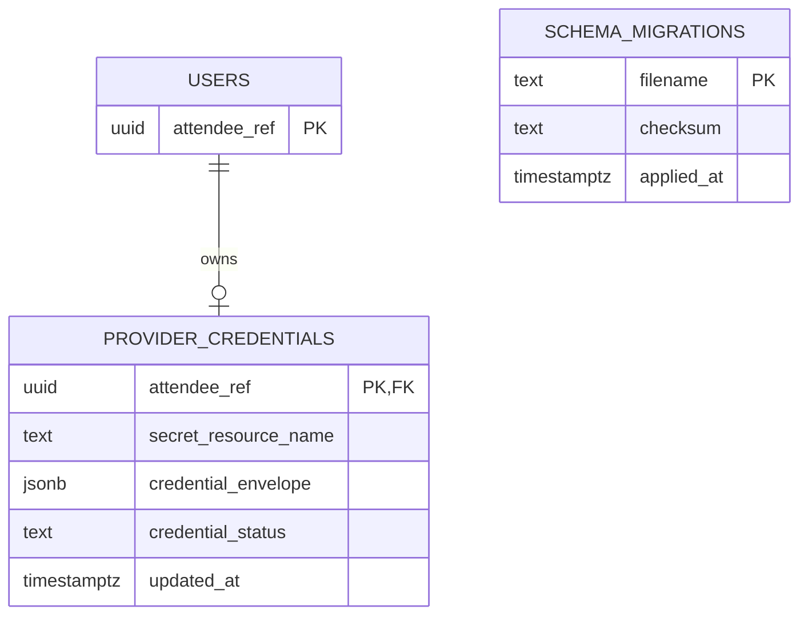

# VPS移行差分ER図

## 1. 文書概要

- 対象システム: OpenClaw Secretary
- 文書種別: ER図
- 版数: 1.0
- 最終更新日: 2026-08-30
- 位置づけ: VPS移行で直接変更するentityだけを示す差分図

## 2. 目的

利用者とprovider credentialの関係、および独立したmigration履歴を可視化する。

## 3. 対象範囲

### 3.1 対象

`users`、`provider_credentials`、`schema_migrations`を対象とする。

### 3.2 対象外

既存DB全体のER図はBack側のDB設計正本へ委ねる。

## 4. 前提

`provider_credentials`は利用者ごとに最大1行とし、refresh tokenを暗号化envelopeで保存する。

## 5. 本文

### 5.1 主な反映事項

- Secret Manager resource参照と暗号化envelopeを移行期間中だけ並存させる。
- migration履歴は業務entityから独立する。

### 5.2 Mermaid ER図

### 5.3 注記

このER図はVPS移行差分だけを表す。既存tableを削除または統合する判断を含まない。

## 6. 未確定事項

`secret_resource_name`を削除した後のER図更新は移行完了migrationと同じpull requestで行う。

## 7. 関連文書

- `db_design_document.md`
- `db_columns_list_with_relations.md`
- Backの`migrations/`
