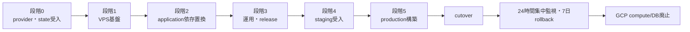

# VPS移行実装タスク一覧

## 1. 文書概要

- 対象システム: OpenClaw Secretary
- 文書種別: 実装タスク分解
- 版数: 1.1
- 最終更新日: 2026-08-31
- 位置づけ: 承認済みVPS移行設計を実装、検証、移行へ進める作業順序の正本

## 2. 目的

VPS移行の要件と設計を、担当repository、依存関係、完了条件、検証証跡が明確な実装単位へ分解する。

## 3. 対象範囲

### 3.1 対象

ConoHa VPS、Cloudflare DNS、Terraform、Ansible、Docker Compose、PostgreSQL、BackのGCP依存置換、秘密情報、非同期処理、監視、backup、CI/CD、staging検証、production cutover、GCP compute/DB廃止を対象とする。

### 3.2 対象外

根拠のないVPS再比較、業務機能追加、画面再設計、OpenAPIの業務契約変更、AI model変更は対象外とする。REQ-GOV-001が発動した場合の停止、Evidence収集、Architecture再評価は対象に含める。

## 4. 前提

- CHK-APPROVAL-001は2026-08-30のユーザー指示「次の工程のタスク分解へ進めて」により通過済みである。
- VPSは現時点の第一選択実行基盤とし、ConoHa VPS Ver.3.0を基準にする。DEC-007の発動時は不可逆に固定せず再評価する。
- ConoHa Terraform ProviderはVPS Instance、SSH鍵、Volume、Security Group、Security Group Ruleだけを管理する。
- DNSはCloudflare Terraform Providerで管理し、ConoHa ProviderへDNS resourceを追加しない。
- RTO測定は`process_flow_design.md` §5.3を正本とする。
- rootのGCP HCLはTASK-MIG-004まで削除せず、移行元とrollback構成として保持する。
- OPEN-001からOPEN-004は実装タスク内の受入試験で確定し、試験前に確定値として扱わない。

## 5. 本文

### 5.1 状態と優先順位

| 項目 | 値 |
|---|---|
| タスク状態 | 未着手、進行中、保留、完了 |
| 要件優先度 | Mustをproduction cutoverの必須gate、Shouldを期限付き判定対象とする |
| 証跡 | CI実行URL、plan artifact、test report、監査ledger、承認記録のいずれかをタスクへ添付する |
| 変更単位 | Terraform、Back、Frontのrepositoryを跨ぐ変更は別pull requestに分け、契約試験で結合する |
| production制約 | TASK-VAL-001からTASK-VAL-006が合格するまでproduction applyとDNS切替を禁止する |

### 5.2 実行段階

| 段階 | 目的 | 対象タスク | 完了gate |
|---|---|---|---|
| 0 | providerと外部資源の成立性確認 | TASK-BASE-001〜005 | ConoHa対応5種、Cloudflare DNS、remote state、off-site保存先の受入成功 |
| 1 | VPS基盤とDB実行環境の構築 | TASK-INF-001〜004、TASK-NET-001、TASK-DB-001 | clean staging hostをIaCから再構築し、公開portとDB永続化試験に合格 |
| 2 | applicationのGCP実行基盤依存置換 | TASK-APP-001、TASK-AUTH-001、TASK-SEC-001〜002、TASK-DB-002、TASK-JOB-001〜002、TASK-EXT-001 | Backの`npm run check`とVPS Compose結合試験に合格 |
| 3 | 運用とrelease自動化 | TASK-OPS-001〜003、TASK-REL-001〜002、TASK-DOC-001 | backup、alert、署名、rollback、runbook rehearsalに合格 |
| 4 | staging受入 | TASK-VAL-001〜006 | 全Must要件を検証し、cutover承認記録を作成 |
| 5 | production移行と安定化 | TASK-MIG-001〜004 | 7日安定稼働、rollback期間終了、GCP停止と請求確認 |

### 5.3 段階0: 成立性確認

| TASK-ID | 対応REQ | 対応UC | 対象領域 | 作業内容 | 完了条件 | 検証方法 | 依存タスク |
|---|---|---|---|---|---|---|---|
| TASK-BASE-001 | REQ-INF-002、REQ-INF-004 | UC-INF-001 | Terraform repository | `vps/terraform`、`vps/ansible`、`vps/compose`、`vps/policies`、`vps/tools`、`vps/runbooks`を作成し、既存GCP root stateとVPS stateを分離する | `vps/`からroot GCP moduleを参照せず、既存GCP planに差分が出ない | `terraform fmt -check -recursive`、既存root plan差分確認、directory ownership review | なし |
| TASK-BASE-002 | REQ-INF-002、REQ-INF-004 | UC-INF-001 | Terraform state | VPS本体と異なる障害領域にremote backendを用意し、`shared-edge`、`staging`、`production`のstateとapply権限を分離する | versioning、encryption、public access拒否、同時apply競合拒否、旧version復元が成功する | 競合apply試験、state version復元試験、権限negative test | TASK-BASE-001、TASK-BASE-005 |
| TASK-BASE-003 | REQ-INF-002 | UC-INF-001 | ConoHa Provider | disposable環境でProvider版を固定し、VPS Instance、SSH鍵、Volume、Security Group、Security Group Ruleのcreate、change、import、destroyを検証する | 5種すべての試験結果と既知制約を記録し、DNS resourceが構成に存在しない | provider schema確認、plan/apply/import/drift/destroy試験 | TASK-BASE-001 |
| TASK-BASE-004 | REQ-INF-004 | UC-INF-001、UC-MIG-001 | Cloudflare Provider | 既存zoneをdata参照またはimportし、非production名のDNS recordで作成、値変更、TTL変更、drift検知、旧値復帰、record削除を行う | zoneをdestroy対象にせず、record単位の変更とrollbackが再現できる | plan/apply、管理画面での意図的drift、refresh-only plan、rollback試験 | TASK-BASE-001 |
| TASK-BASE-005 | REQ-OPS-002 | UC-OPS-003 | 外部保存先 | off-site backupとremote stateの保存先を比較試験し、保存先、保持機能、暗号化方式、locking可否、resource IDを台帳へ記録する | VPS事業者と異なる障害領域の保存先が決まり、14日・週次8・月次12の保持と復元経路を確認できる | upload/download、versioning、retention、credential失効、月額見積の確認 | TASK-BASE-001 |

### 5.4 段階1: VPS基盤

| TASK-ID | 対応REQ | 対応UC | 対象領域 | 作業内容 | 完了条件 | 検証方法 | 依存タスク |
|---|---|---|---|---|---|---|---|
| TASK-INF-001 | REQ-INF-001、REQ-INF-002 | UC-INF-001 | ConoHa Terraform modules | `server`、`ssh-key`、`volume`、`security-group` moduleとstaging/production envを実装し、Ansible inventory用outputを生成する | 同一moduleからstagingとproduction planを生成し、production Volumeに削除防止guardがある | `terraform validate`、`terraform test`、TFLint、plan、destroy検知試験 | TASK-BASE-002、TASK-BASE-003 |
| TASK-INF-002 | REQ-INF-004、REQ-MIG-001 | UC-INF-001、UC-MIG-001 | Cloudflare Terraform module | `cloudflare/dns` moduleと`shared-edge` envを実装し、zone ID、record、TTL、proxy設定を変数化する | production zoneを再作成せず、record差分だけをplanできる | import済みstateのplan無差分、record変更と旧値rollback | TASK-BASE-002、TASK-BASE-004 |
| TASK-INF-003 | REQ-INF-003 | UC-INF-002 | Ansible | base、SSH hardening、Docker、時刻同期、patch、journald、再起動要求監視のroleとplaybookを実装する | clean hostへ2回実行して2回目の変更件数が0になり、root/password loginが拒否される | ansible-lint、check mode、idempotency試験、SSH negative test | TASK-INF-001 |
| TASK-NET-001 | REQ-NET-001、REQ-NET-002 | UC-SEC-002、UC-OPS-001 | network・firewall | ConoHa Security Group、host firewall、overlay networkを構成し、初期SSHからoverlay限定SSHへ切り替える | Internetから80/443だけ到達し、22、5432、metrics、Docker socketへ到達できない | 外部port scan、overlay接続、public SSH拒否、DB接続拒否 | TASK-INF-001、TASK-INF-003 |
| TASK-INF-004 | REQ-INF-001、REQ-INF-003 | UC-INF-001、UC-INF-002 | Docker Compose | Caddy、OIDC proxy、Gateway、Auth Bootstrap、API、worker、PostgreSQL、backup、exporterのCompose構成、network、health check、resource limitを実装する | `docker compose config`に成功し、Caddy以外のservice portがpublic interfaceへbindされない | Compose構文検査、container policy scan、network到達試験 | TASK-INF-003、TASK-NET-001、TASK-DB-001 |
| TASK-DB-001 | REQ-DB-001、REQ-OPS-002 | UC-DB-001、UC-OPS-003 | PostgreSQL | PostgreSQL 15とpgvectorのdigest固定image、独立data volume、role、connection上限、WAL archive設定を実装する | container再作成後もdataを保持し、pgvector、archive_mode、role分離を確認できる | SQL検査、volume再attach、runtime DDL拒否、WAL生成確認 | TASK-INF-001、TASK-BASE-005 |

### 5.5 段階2: application依存置換

| TASK-ID | 対応REQ | 対応UC | 対象領域 | 作業内容 | 完了条件 | 検証方法 | 依存タスク |
|---|---|---|---|---|---|---|---|
| TASK-APP-001 | REQ-INF-001、REQ-DB-001 | UC-INF-001、UC-DB-001 | Back DB接続・設定 | `src/config.js`と`src/db-connection.js`をprovider切替可能にし、VPS productionではPostgreSQL TLS接続を使い、Cloud SQL Connectorを要求しない | VPS設定で`DATABASE_URL`または分離DB設定から接続し、GCP移行期間中のCloud SQL経路も明示的なmodeで試験できる | Back `npm run check`、PostgreSQL結合試験、設定不足negative test | TASK-DB-001 |
| TASK-AUTH-001 | REQ-INF-001、REQ-SEC-001 | UC-INF-001、UC-SEC-001 | Back認証境界 | IAP assertion依存をOIDC proxyからの署名済みidentity境界へ置換し、GatewayとAuth Bootstrapのpublic route、issuer、audience、nonce、domain検証を実装する | 許可domainのbrowser/Electron loginが成功し、未認証、改ざんheader、未許可domain、直接API接続が拒否される | token/header negative test、Gateway/Auth Bootstrap結合試験、Front handoff smoke | TASK-INF-004 |
| TASK-SEC-001 | REQ-SEC-001 | UC-SEC-001 | SOPS/age・secret配備 | SOPS policy、age recipient、production/staging暗号化file、tmpfs復号、Compose file mount、rotation手順を実装する | repository、Terraform state、Ansible inventory、disk永続領域にsecret平文がなく、service再起動後にtmpfsから読める | secret scan、state scan、disk scan、rotation rehearsal | TASK-INF-003 |
| TASK-SEC-002 | REQ-SEC-002 | UC-SEC-001 | Back暗号化・KEK | KMS専用実装をinterface化し、DB外KEKによるAES-256-GCM envelope、keyVersion、AAD、再暗号化、旧鍵廃止を実装する | DB dumpだけではrefresh tokenを復号できず、新旧keyVersionの段階rotationと復元後の復号に成功する | unit test、dump秘密値検査、rotation、backup restore後の復号試験 | TASK-SEC-001、TASK-DB-002 |
| TASK-DB-002 | REQ-DB-002、REQ-SEC-002 | UC-DB-001、UC-SEC-001 | Back migration | 既存連番migrationへcredential envelope、outbox、polling状態に必要な差分を追加し、advisory lock、SHA-256 checksum、transactionを維持する | 空DB migration、既存DB追適用、再実行、改変済みmigration拒否がすべて成功する | `npm run migrate`、Back migration test、schema/column/ER文書照合 | TASK-APP-001 |
| TASK-JOB-001 | REQ-JOB-001 | UC-JOB-001 | Back outbox worker | Cloud Tasks送信をDB outbox consumerへ置換し、lease、`SKIP LOCKED`、idempotency、指数backoff、retry上限、dead-letterを実装する | 同一eventの並列取得で業務処理が1回だけ成立し、上限超過eventがdead-letterへ移る | 並列worker試験、process kill、重複配送、retry/dead-letter fault test | TASK-DB-002 |
| TASK-JOB-002 | REQ-JOB-001 | UC-JOB-001 | systemd timer | Cloud Scheduler jobsをsystemd timerとoneshot serviceへ写像し、job token、timeout、重複起動抑止、journal記録を実装する | 全既存jobが定義周期で起動し、同時起動が抑止され、失敗が監視へ通知される | timer一覧照合、二重起動試験、timeout、失敗通知試験 | TASK-INF-003、TASK-AUTH-001、TASK-JOB-001 |
| TASK-EXT-001 | REQ-EXT-001 | UC-EXT-001 | Gmail通知 | 移行期間のPub/Sub push endpointをVPSへ変更可能にし、署名検証、watch更新、1時間polling fallback、重複抑止を実装する | Push停止後にpollingが欠落を回収し、同一mailを二重処理しない | Pub/Sub push試験、push停止、1時間polling、quotaと遅延記録 | TASK-AUTH-001、TASK-JOB-002 |

### 5.6 段階3: 運用とrelease

| TASK-ID | 対応REQ | 対応UC | 対象領域 | 作業内容 | 完了条件 | 検証方法 | 依存タスク |
|---|---|---|---|---|---|---|---|
| TASK-OPS-001 | REQ-OPS-002 | UC-OPS-003 | backup・restore | WAL-GまたはpgBackRestでWAL、base backup、logical dumpをclient-side暗号化してoff-siteへ送信し、保持とrestore ledgerを実装する | WAL age 15分以内、日次base backup、規定保持、checksum、隔離restoreが成立する | backup age監視、世代削除、checksum破損、月次restore試験 | TASK-BASE-005、TASK-DB-001、TASK-SEC-001 |
| TASK-OPS-002 | REQ-OPS-001、REQ-OPS-003 | UC-OPS-002、UC-OPS-004 | 監視・ログ | node/postgres exporter、構造化log転送、外部uptime、alert、RTO timestamp記録を実装する | requirementsのwarning/critical閾値で通知し、PII/tokenをlogへ出さず、host停止を外部から検知する | alert発火・復旧、log禁止field scan、host power-off試験 | TASK-INF-004、TASK-AUTH-001、TASK-OPS-001 |
| TASK-REL-001 | REQ-REL-001 | UC-REL-001 | Back/Front CI | 4 imageをbuildし、Syft SBOM、Trivy scan、Cosign keyless署名、provenance、digest manifestを発行するworkflowを実装する | HIGH/CRITICAL未処置imageと未署名imageがrelease gateを通らず、承認済みdigestだけを配備対象にできる | CI negative test、Cosign verify、SBOM artifact確認 | TASK-APP-001、TASK-AUTH-001、TASK-JOB-001 |
| TASK-REL-002 | REQ-REL-002 | UC-REL-002 | deploy・rollback | backup、署名検証、migration一回実行、Compose更新、health/smoke、旧digest rollback、排他制御を実装する | 同時deployを拒否し、失敗時にschema互換な旧digestへ戻してsmoke testが成功する | staging release rehearsal、migration失敗、health失敗、rollback試験 | TASK-INF-004、TASK-DB-002、TASK-OPS-001、TASK-REL-001 |
| TASK-OPS-003 | REQ-COST-001、REQ-GOV-001 | UC-OPS-005、UC-OPS-006 | 費用運用 | ConoHa、Cloudflare、off-site保存先、残存GCP API、運用作業、Restore訓練、Incident対応の月次台帳を作り、7,000円超過通知と3か月総保有コスト比較を実装する | provider別実額、運用時間、予測を月次記録し、予算超過と代替Architecture以上の総保有コストを検知できる | sample請求入力、閾値未満/超過通知、3か月比較、権限確認 | TASK-BASE-005 |
| TASK-DOC-001 | REQ-INF-003、REQ-OPS-002、REQ-REL-002、REQ-MIG-001、REQ-GOV-001 | UC-INF-002、UC-OPS-003、UC-OPS-006、UC-REL-002、UC-MIG-001 | runbook | bootstrap、release、restore、incident、cutover、DNS rollback、credential rotation、Architecture再評価のrunbookを実コマンドと証跡保存先付きで作成する | 別operatorがrunbookだけでstagingの構築、release、restore、rollbackと再評価開始時の安全停止を完遂する | tabletop review、staging rehearsal、再評価演習、手順差分記録 | TASK-INF-003、TASK-INF-004、TASK-OPS-001、TASK-REL-002 |

### 5.7 段階4: staging受入

| TASK-ID | 対応REQ | 対応UC | 対象領域 | 作業内容 | 完了条件 | 検証方法 | 依存タスク |
|---|---|---|---|---|---|---|---|
| TASK-VAL-001 | REQ-INF-001〜004、REQ-DB-001〜002 | UC-INF-001、UC-INF-002、UC-DB-001 | staging全体 | 空のstagingをTerraform、Ansible、Compose、migrationだけで構築し、全serviceとDNSを接続する | clean host再構築、全health、認証済み主要操作、plan無差分が成功する | end-to-end構築、smoke、drift試験 | TASK-INF-002、TASK-INF-004、TASK-APP-001、TASK-AUTH-001、TASK-DB-002 |
| TASK-VAL-002 | REQ-NET-001〜002、REQ-SEC-001〜002、REQ-REL-001 | UC-SEC-001、UC-SEC-002、UC-OPS-001、UC-REL-001 | security受入 | port、OIDC、secret、DB dump、container、image署名、DNS token権限のnegative testを実施する | security_designのTHR-001からTHR-011の検証がすべて合格する | 外部scan、token改ざん、secret scan、dump検査、未署名拒否、DNS権限拒否 | TASK-SEC-002、TASK-NET-001、TASK-REL-001、TASK-VAL-001 |
| TASK-VAL-003 | REQ-OPS-003 | UC-OPS-004 | 負荷試験 | 2ユーザー・1日30メール相当とburstを72時間実行し、memory、disk、API p95、DB接続、queue backlogを記録する | memory 80%未満、disk 70%未満、API p95 2秒未満を満たし、OPEN-001を確定する | 72時間report、resource graph、閾値判定 | TASK-OPS-002、TASK-VAL-001 |
| TASK-VAL-004 | REQ-OPS-002、REQ-OPS-003 | UC-OPS-003、UC-OPS-004 | DR受入 | host障害を想定し、代替VPS、base backup、WAL、service、DNS復旧を実行してRPO/RTOを測定する | `process_flow_design.md` §5.3の証跡を残し、RPO 15分、RTO 4時間以内を満たす。超過時は2台化タスクを追加する | host停止からのDR rehearsal、restore整合性、RTO計算review | TASK-OPS-001、TASK-OPS-002、TASK-DOC-001、TASK-VAL-001 |
| TASK-VAL-005 | REQ-JOB-001、REQ-REL-002 | UC-JOB-001、UC-REL-002 | 障害注入 | worker kill、retry storm、migration失敗、health失敗、旧digest復帰を実施する | lease回収、dead-letter、deploy停止、rollback後smokeが設計どおりに成立する | fault injection report、release ledger、dead-letter確認 | TASK-JOB-002、TASK-REL-002、TASK-VAL-001 |
| TASK-VAL-006 | REQ-EXT-001、REQ-MIG-001 | UC-EXT-001、UC-MIG-001 | cutover rehearsal | production相当copyで書込停止、export、restore、checksum、OAuth/Pub/Sub/Cloudflare DNS切替、旧値復帰を通しで実施する | データ差分0、OAuth callback成功、Pushとpolling成功、DNS旧値rollback成功、所要時間記録がある | rehearsal report、件数/checksum、endpoint smoke、DNS監査log | TASK-EXT-001、TASK-REL-002、TASK-DOC-001、TASK-VAL-002、TASK-VAL-003、TASK-VAL-004、TASK-VAL-005 |

### 5.8 段階5: production移行

| TASK-ID | 対応REQ | 対応UC | 対象領域 | 作業内容 | 完了条件 | 検証方法 | 依存タスク |
|---|---|---|---|---|---|---|---|
| TASK-MIG-001 | REQ-INF-001、REQ-INF-002、REQ-INF-003、REQ-INF-004、REQ-NET-001、REQ-NET-002 | UC-INF-001、UC-INF-002、UC-OPS-001 | production基盤 | 承認済みmodule、playbook、digestでproduction VPS、Volume、Security Group、overlay、Compose、DNS待機recordを構築する | production plan承認、port scan合格、DB空状態、全service health、秘密値非露出を確認する | production plan artifact、Ansible recap、Compose/port/secret検査 | TASK-VAL-001、TASK-VAL-002、TASK-VAL-003、TASK-VAL-004、TASK-VAL-005、TASK-VAL-006 |
| TASK-MIG-002 | REQ-MIG-001、REQ-EXT-001 | UC-MIG-001、UC-EXT-001 | production cutover | 変更窓でGCP書込停止、最終export、VPS restore、migration、整合性確認、OAuth/Pub/Sub/Cloudflare DNS切替、VPS書込開始を実行する | 件数、checksum、sequence、認可が一致し、主要業務smokeとGmail受信に成功する | cutover checklist、DB比較、OAuth、Push/polling、DNS、smoke証跡 | TASK-MIG-001 |
| TASK-MIG-003 | REQ-OPS-001〜003、REQ-REL-002、REQ-GOV-001 | UC-OPS-002〜004、UC-OPS-006、UC-REL-002 | 安定化 | cutover後24時間を集中監視し、7日間GCPをread-only rollback先として保持して、backup/restore、月額、DEC-007発動条件を確認する | 重大incidentなし、日次backup 7回、WAL監視正常、7日目restore成功、再評価未発動または再評価Decision完了、rollback終了承認がある | alert review、backup catalog、restore report、請求速報、再評価条件review | TASK-MIG-002 |
| TASK-MIG-004 | REQ-MIG-001、REQ-COST-001、REQ-GOV-001 | UC-MIG-001、UC-OPS-005、UC-OPS-006 | GCP廃止 | 証跡とbackupを保全し、Cloud Run、Cloud SQL、Scheduler、Tasks、IAP、KMS、Secret Managerの停止順序をplanし、承認後に廃止する。継続するPub/Sub、Vertex AI、DLPを別stateへ分離する。DEC-007発動中は廃止を停止する | compute/DB課金が停止し、残存GCP resourceと所有stateが台帳に一致し、VPS運用に影響がなく、Architecture再評価が未決でない | Terraform plan/apply、GCP請求確認、残存resource棚卸し、7日後smoke、再評価Decision確認 | TASK-MIG-003 |

### 5.9 依存関係

段階0ではTASK-BASE-003、TASK-BASE-004、TASK-BASE-005を並列実行できる。段階2ではTASK-AUTH-001、TASK-SEC-001、TASK-APP-001を、段階3ではTASK-OPS-002、TASK-REL-001、TASK-OPS-003を依存条件の範囲内で並列実行できる。production cutover以降は並列実行せず、TASK-MIG-002からTASK-MIG-004まで順番に実行する。

### 5.10 production移行gate

次の条件をすべて満たすまでTASK-MIG-001を開始しない。

1. TASK-BASE-003とTASK-BASE-004のprovider受入結果が承認済みである。
2. Must要件に対応するTASK-VAL-001、TASK-VAL-002、TASK-VAL-005、TASK-VAL-006が合格している。
3. TASK-VAL-003の性能基準を満たすか、増強後の再試験が合格している。
4. TASK-VAL-004でRPO 15分、RTO 4時間以内を満たすか、2台化追補が完了している。
5. restore、release rollback、DNS rollback、GCP rollbackのrunbookを別operatorが再現している。
6. production変更窓、実行者、承認者、rollback判断者、連絡経路が記録されている。

## 6. 未確定事項

- off-site backupとremote stateの具体的な保存先はTASK-BASE-005で確定する。確定まではTASK-BASE-002とTASK-OPS-001を完了扱いにしない。
- ConoHa Providerの固定versionはTASK-BASE-003の受入結果で確定する。
- refresh token用KEKの最終保管方式はTASK-SEC-002とTASK-VAL-002、TASK-VAL-004の結果でOPEN-003を更新する。
- Pub/Sub廃止判断はTASK-EXT-001とTASK-VAL-006のquota・遅延記録後に行う。TASK-MIG-004では継続利用を既定とする。
- TASK-VAL-004でRTO 4時間を超えた場合はproductionへ進まず、2台構成の設計追補と実装タスクを追加する。

## 7. 関連文書

- `shared_understanding.md`
- `requirements_definition.md`
- `UseCase_List.md`
- `process_flow_design.md`
- `infra_architecture_design.md`
- `package_structure_design.md`
- `security_design.md`
- `rtm.md`
- `validation_report.md`
