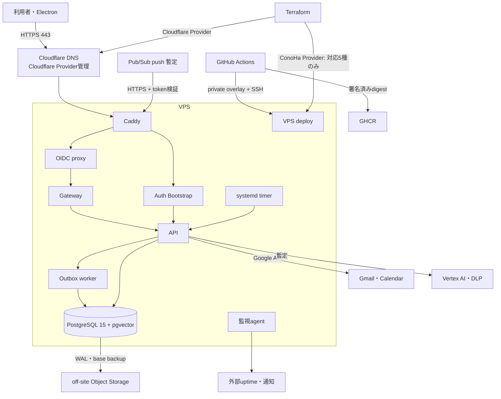

# VPSインフラアーキテクチャ設計書

## 1. 文書概要

- 対象システム: OpenClaw Secretary
- 文書種別: インフラアーキテクチャ設計
- 版数: 1.1
- 最終更新日: 2026-08-31
- 位置づけ: GCPからVPSへ移行する目標構成の正本

## 2. 目的

VPS上にアプリ、DB、認証、非同期処理、監視、backup、CI/CDを再現可能に構築し、GCP compute/DBを廃止する。

## 3. 対象範囲

### 3.1 対象

VPS、network、OS、container、PostgreSQL、OIDC、secret、queue、timer、監視、backup、release、復旧を対象とする。

### 3.2 対象外

アプリ業務仕様、OpenAPI、画面、AI prompt、Gmail/Calendar APIの業務利用方法は対象外とする。

## 4. 前提

- CHK-GOAL-001によりVPSを現時点の第一選択とする。DEC-007の発動時はProduction変更と危険な外部Actionを停止し、別ADRでArchitectureを再評価する。
- CHK-IMPL-001に基づきConoHa VPS Ver.3.0を基準案とする。
- CHK-IMPL-002に基づきDNSはCloudflare DNSとし、ConoHa Terraform Providerの対象外とする。
- 初期productionはCHK-OPS-001の12GB単一VPSとし、`process_flow_design.md` §5.3のRTO測定が目標超過した場合に2台構成へ移行する。
- Gmail Pub/SubとVertex AI/DLPはCHK-SCOPE-001、CHK-EXT-001に基づき外部APIとして暫定利用できる。

## 5. 本文

### 5.1 設計方針

1. ConoHa Terraform Providerは、公式に対応するVPS Instance、SSH鍵、Volume、Security Group、Security Group Ruleだけを管理する。
2. DNS zoneとrecordはCloudflare Terraform Providerで管理し、ConoHa Terraform ProviderにはDNS resourceを定義しない。
3. OSはAnsible、serviceはDocker Composeで管理する。
4. production hostへの手動package installと手動container起動を禁止する。
5. public ingressはCaddyの80/443だけとし、SSHとDBはprivate経路に限定する。
6. databaseと動的credentialを同一障害領域に置く代わりに、暗号化backupとDB外KEKを必須とする。
7. release imageはdigestで固定し、署名検証後に配備する。
8. GCP resourceは一括廃止せず、VPS cutover、7日監視、backup restore確認の後に順次停止する。

### 5.2 全体構成図

### 5.3 環境構成

| 環境 | 構成 | 用途 | データ |
|---|---|---|---|
| local | Docker Compose | 開発・unit/integration | synthetic |
| staging | 4GB以上のVPS 1台 | migration、release、restore、security試験 | production由来PIIを禁止 |
| production初期 | 12GB、6vCPU、100GB NVMe VPS 1台 | 2ユーザー、1日30メールから開始 | production |
| production拡張 | 12GB VPS 2台 + private network + LB | RTO 4時間を満たせない場合 | primary/standby |

production初期のresource目標は、OS 1GB、PostgreSQL 3GB、application合計3GB、page cacheと予備5GBとする。72時間負荷試験でmemory 80%またはdisk 70%を超えた場合は、vertical scaleまたはDB分離を行う。

### 5.4 主要コンポーネント

| コンポーネント | 採用案 | 責務 | 公開port |
|---|---|---|---|
| reverse proxy | Caddy | TLS、routing、security header、rate limit連携 | 80/443 |
| OIDC proxy | oauth2-proxy | Google Workspace login、domain制約、session | なし |
| Gateway | 既存gateway image改修 | claimant正規化、private API proxy | なし |
| Auth Bootstrap | 既存bootstrap image | one-time handoff redeem | Caddy経由限定 |
| API | 既存runtime image改修 | API、internal job endpoint | なし |
| worker | Back imageのworker command | outbox lease、retry、dead-letter | なし |
| timer | systemd timer | polling、watch更新、retention、reconcile | なし |
| DB | PostgreSQL 15 + pgvector | 業務DB、outbox、migration履歴 | host非公開 |
| backup | WAL-GまたはpgBackRest | WAL archive、base backup、restore | outboundのみ |
| host監視 | node_exporter、postgres_exporter、Vector | metricsとlog転送 | privateのみ |
| 管理network | TailscaleまたはWireGuard | SSH、metrics、管理endpoint | overlay限定 |
| 権威DNS | Cloudflare DNS | zone、A/AAAA/CNAME record、TTL、drift検知 | 該当なし |

### 5.5 Docker network

| network | 接続container | host公開 |
|---|---|---|
| edge | Caddy、OIDC proxy、Gateway、Auth Bootstrap | Caddy 80/443のみ |
| app | Gateway、Auth Bootstrap、API、worker | なし |
| data | API、worker、migration、PostgreSQL、backup | なし |
| observability | exporter、log agent | なし |

PostgreSQLの`5432`、Docker socket、metrics portをhost public interfaceへbindしない。CaddyはDocker socketを直接mountせず、静的upstream名を使う。

### 5.6 通信フロー

#### 利用者通信

1. 利用者はCloudflare DNSで名前解決し、VPS public IPへ接続する。
2. CaddyがTLSを終端し、browser routeをOIDC proxyへ渡す。
3. OIDC proxyはGoogle ID tokenのissuer、audience、nonce、email、hosted domainを検証する。
4. Gatewayは正規化済みidentityだけをAPIへ渡す。
5. APIは既存DB authorizationを実行する。

#### Electronの認証引き渡し

1. ElectronはGoogle OAuthを開始する。
2. callbackはCaddy経由でAuth Bootstrapへ到達する。
3. Auth Bootstrapは一回限り・短時間のhandoffだけを処理する。
4. redeem後のtokenをrendererへ保存せず、Electron main processが保持する。

#### 内部job

1. systemd timerはlocalhostまたはprivate app networkの専用endpointを起動する。
2. job tokenは用途別に分離し、public requestから指定できないheaderに載せる。
3. outbox workerは`FOR UPDATE SKIP LOCKED`相当のlease処理で重複実行を抑止する。
4. retry上限到達時にdead-letterへ遷移し、alertを発行する。

#### Gmail通知

1. 移行期間はGoogle Pub/Sub push subscriptionのendpointをVPSへ変更する。
2. Pub/Sub tokenのissuer、audience、service identityを検証する。
3. Push停止時はtimerによるpollingで欠落を回収する。

### 5.7 運用アクセス

- production SSHの送信元はoverlay networkだけとする。
- root login、password authentication、SSH agent forwardingを無効化する。
- operatorごとに公開鍵を分け、共用秘密鍵を使用しない。
- sudo実行をjournaldへ記録し、90日保持する。
- GitHub Actionsは短時間のoverlay credentialで接続し、production hostへ常駐runnerを置かない。
- emergency consoleはVPS control panelのMFAアカウントで使用し、使用後にincidentへ記録する。

### 5.8 セキュリティ方針

- security groupとhost firewallを二重にdefault denyとする。
- OS security updateを週次、critical修正を72時間以内に適用する。
- unattended upgrade後の再起動要求を監視し、変更窓で再起動する。
- secretはrepositoryへ平文commitせず、SOPS/ageで暗号化する。
- Cloudflare API tokenは対象zoneのDNS編集に必要な最小権限へ限定し、account全体を操作できるtokenを使用しない。
- 動的refresh tokenはcredential envelopeとしてDBへ保存し、KEKはDB/backupから分離する。
- production backupをclient-side encryptionしてからoff-siteへ送信する。
- containerはread-only root filesystem、non-root user、capability dropを基本とし、書込volumeを明示する。

### 5.9 DB構成

- PostgreSQL 15のminor versionをimage digestで固定する。
- pgvector extensionをmigration前に有効化する。
- `runtime`、`migration`、`backup`、`monitoring` roleを分離する。
- application connection pool上限は初期20接続とし、DBの`max_connections`と同時に負荷試験する。
- DB data volumeはcontainer削除から独立させ、TerraformのVPS削除と同時削除しない。
- `fsync=on`、`full_page_writes=on`、`archive_mode=on`を維持する。

### 5.10 backup・復旧

| 対象 | 周期 | 保持 | 保存先 | 検証 |
|---|---|---|---|---|
| WAL | 15分以内 | base backupの保持期間と整合 | off-site Object Storage | 月次replay |
| base backup | 日次 | 14日、週次8、月次12 | off-site Object Storage | 月次restore |
| logical dump | 日次 | 14日 | 別prefixまたは別事業者 | table件数確認 |
| SOPS設定 | 変更時 | Git履歴 | private repository | CI decrypt構文試験 |
| Terraform state | apply時 | versioning | remote backend | 四半期復元 |

同一VPSのsnapshotだけをDB backupとみなさない。少なくとも1copyはVPS事業者と異なる障害領域へ保存する。

### 5.11 監視・ログ方針

| 監視 | warning | critical |
|---|---:|---:|
| HTTP availability | 2回連続失敗 | 5分停止 |
| API p95 | 2秒超を10分 | 5秒超を5分 |
| memory | 75%を15分 | 90%を5分 |
| disk | 70% | 85% |
| DB connection | 70% | 90% |
| backup age | 26時間 | 36時間 |
| WAL archive age | 15分 | 30分 |
| TLS期限 | 30日 | 7日 |
| dead-letter | 1件 | 10件または30分増加 |

host停止をhost内監視だけで検出しない。外部uptime監視から`/livez`と認証境界を別々に確認する。PII、token、本文、OAuth codeをlogへ出力しない。

### 5.12 CI/CD方針

#### 変更要求時

1. Back/Front test、OpenAPI contract、migration checksumを検証する。
2. Docker imageをbuildし、TrivyでHIGH/CRITICALを拒否する。
3. SyftでSBOMを生成する。
4. Terraform fmt/validate/test、TFLint、provider schema checkを実行する。
5. Ansible lint、check mode、Molecule相当のrole試験を実行する。
6. Docker Compose configとsecret漏えいscanを実行する。

#### リリース時

1. 4 imageをGHCRへpushする。
2. GitHub OIDCでCosign keyless署名とprovenanceを生成する。
3. digestだけを含むrelease manifestを承認対象にする。
4. stagingへ配備し、migration、smoke、security scan、restore試験を実行する。
5. GitHub Environment承認後にproductionへ配備する。
6. productionは一度に1つのdeployだけを許可する。

### 5.13 拡張条件

次のいずれかを2回観測した場合、単一VPSから2台構成へ移行する。

- 月間停止時間が43分を超える。
- `process_flow_design.md` §5.3の正本定義で測定した復旧訓練のRTOが4時間を超える。
- memory 80%超またはdisk I/O wait 20%超が15分継続する。
- release時の停止が利用部門の許容時間を超える。

2台構成ではNode Aをapplication + PostgreSQL primary、Node Bをapplication standby + PostgreSQL streaming replicaとし、private networkで同期する。DBの自動昇格はsplit-brain試験を通すまで導入せず、手動承認で昇格する。

### 5.14 構築段階

| 段階 | 内容 | 完了判定 |
|---|---|---|
| 0 | ConoHa/Cloudflare provider、state、network、DNSのdisposable試験 | ConoHa対応5種のcreate/change/destroy、Cloudflare DNS recordのimport/change/rollback、state復元成功 |
| 1 | staging VPS、Ansible、Compose | clean host再構築成功 |
| 2 | DB、migration、backup | 空DBmigration、restore、権限拒否成功 |
| 3 | OIDC、secret、KMS置換 | login、rotation、dump秘密値検査成功 |
| 4 | job、Pub/Sub、polling | retry、dead-letter、欠落回収成功 |
| 5 | CI/CD、監視 | 未署名拒否、alert、rollback成功 |
| 6 | production cutover rehearsal | Cloudflare DNS/OAuth/DB切替と復帰成功 |
| 7 | production cutover | 24時間集中監視、7日安定稼働 |
| 8 | GCP compute/DB廃止 | backup保全、resource停止、請求確認 |

## 6. 未確定事項

- ConoHa Terraform Providerの対象はVPS Instance、SSH鍵、Volume、Security Group、Security Group Ruleの5種に限定する。DNSは未対応であることが確定しているため段階0の探索対象にせず、Cloudflare Providerで検証する。
- overlay networkはTailscaleとself-hosted WireGuardを比較し、MFA、CI接続、復旧性の試験結果で決める。
- KEKをhost root-only fileに置く初期案は、外部KMS/Vaultとの差分をsecurity reviewで承認する。
- 2台構成のload balancer製品とDB昇格方式は拡張条件成立時に設計追補する。

## 7. 関連文書

- `vps_gcp_comparison.md`
- `requirements_definition.md`
- `package_structure_design.md`
- `security_design.md`
- `process_flow_design.md`
- `rtm.md`
