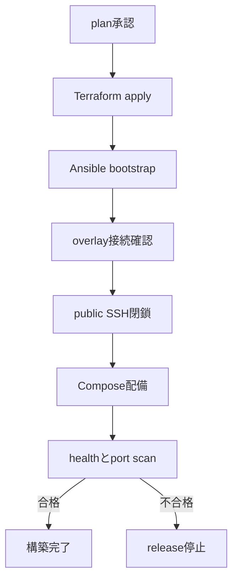

# VPS構築・運用処理フロー設計書

## 1. 文書概要

- 対象システム: OpenClaw Secretary
- 文書種別: 処理フロー設計
- 版数: 1.1
- 最終更新日: 2026-08-31
- 位置づけ: 構築、release、backup復旧、cutoverの実行順序

## 2. 目的

VPS運用で順序を誤ると停止・漏えい・データ損失につながる処理を、正常系と例外系に分けて定義する。

## 3. 対象範囲

### 3.1 対象

初期構築、release、DB復旧、GCPからのcutoverを対象とする。

### 3.2 対象外

アプリケーションの業務処理フローは対象外とする。

## 4. 前提

CHK-GOAL-001、CHK-SCOPE-001、CHK-OPS-001、CHK-EXT-001、CHK-SEC-001、CHK-IMPL-001、CHK-IMPL-002、CHK-APPROVAL-001を参照する。

## 5. 本文

### 5.1 初期構築

- 関連UC: UC-INF-001、UC-INF-002、UC-SEC-002
- 関連REQ: REQ-INF-001、REQ-INF-002、REQ-INF-003、REQ-INF-004、REQ-NET-001、REQ-NET-002
- 起点: Terraform変更の承認
- 事前条件: provider受入試験、state backend、SSH公開鍵、DNS zoneが存在する
- 更新データ: Terraform state、VPS resource、Ansible inventory
- トランザクション境界: Terraform apply単位、Ansible role単位
- 監査・履歴: plan artifact、apply log、Ansible recap
- 関連確認ID: CHK-GOAL-001、CHK-IMPL-001、CHK-IMPL-002

#### 正常系

1. ConoHa Terraform ProviderでSSH鍵、Security Group、Security Group Rule、Volume、VPS Instanceを作成する。
2. Cloudflare Terraform Providerへ既存zoneをimportし、VPSを参照するDNS recordを作成する。ConoHa Terraform ProviderにはDNSを定義しない。
3. 初期SSHを固定送信元IPだけに許可する。
4. Ansibleで運用user、SSH hardening、Docker、firewall、監視を設定する。
5. overlay network接続を確認する。
6. public SSHを閉じ、80/443以外のpublic ingressを拒否する。
7. Docker Compose構成を配備し、health checkを実行する。

#### 例外系

| 条件 | 挙動 | 利用者への結果 | 監査 |
|---|---|---|---|
| Terraform planにdestroyがある | applyを停止する | 承認待ち | plan artifact |
| overlay接続前にSSH閉鎖が要求された | playを失敗させる | 構築未完了 | Ansible log |
| port scanで22または5432が開く | releaseを停止する | security gate失敗 | scan結果 |

#### フロー図

### 5.2 application release

- 関連UC: UC-DB-001、UC-REL-001、UC-REL-002
- 関連REQ: REQ-DB-002、REQ-REL-001、REQ-REL-002
- 起点: 署名済みrelease manifestの承認
- 事前条件: backup成功、disk空き30%以上、旧digest記録済み
- 更新データ: container digest、schema_migrations、release ledger
- トランザクション境界: migrationファイルごとのDB transaction
- 監査・履歴: digest、SBOM、signature、migration checksum、operator
- 関連確認ID: CHK-OPS-001、CHK-SEC-001、CHK-APPROVAL-001

#### 正常系

1. release manifestの署名とimage digestを検証する。
2. DB backupを取得し、Object Storageへの到達を確認する。
3. 新imageをpullする。
4. migration containerを一度だけ実行する。
5. application containerを更新する。
6. `/livez`、認証済みhealth、主要smoke testを実行する。
7. 旧imageをrollback期間中保持する。

#### 例外系

| 条件 | 挙動 | 利用者への結果 | 監査 |
|---|---|---|---|
| image署名不一致 | pull後も起動しない | release拒否 | Cosign結果 |
| migration失敗 | application更新を行わない | 旧版継続 | migration log |
| health失敗 | schema互換なら旧digestへ戻す | 一時停止後復旧 | rollback log |

### 5.3 DB backup復元

- 関連UC: UC-OPS-003、UC-OPS-004
- 関連REQ: REQ-OPS-002、REQ-OPS-003
- 起点: 月次訓練またはDB障害
- 事前条件: off-site backupとWALが取得済み
- 更新データ: 復元先DB、restore ledger
- トランザクション境界: 復元対象時刻
- 監査・履歴: backup ID、WAL終点、所要時間、検証件数
- 関連確認ID: CHK-OPS-001、CHK-SEC-001

#### RTO測定定義（正本）

RTOの測定起点は、`外部監視が異常を最初に検知した時刻`と`最終正常確認時刻 + その監視の設定間隔`のうち早い方とする。Incident宣言時刻や復旧作業開始時刻へ置き換えてはならない。

RTOの測定終点は、外部監視の正常復帰と、認証済み主要smoke testの成功がともに成立した時刻とする。RTOは終点から起点を差し引いた経過時間であり、起点候補、採用起点、監視間隔、終点、判定根拠をrestore ledgerまたはincident記録へ残す。この定義が全VPS移行文書の正本であり、REQ-OPS-003の目標値を確定するときに定義も同時承認する。

#### 正常系

1. 新しい空volumeへPostgreSQLを起動する。
2. base backupを取得する。
3. 指定時刻までWALをreplayする。
4. migration checksum、主要table件数、FK違反、pgvector extensionを確認する。
5. runtime roleのDDL拒否を確認する。
6. 上記の正本定義に従ってRPOとRTOを記録する。

#### 例外系

| 条件 | 挙動 | 利用者への結果 | 監査 |
|---|---|---|---|
| backup checksum不一致 | 当該世代を使用しない | 前世代へ切替 | 破損backup ID |
| WAL欠落 | 到達可能な最終時刻を提示する | RPO逸脱 | 欠落範囲 |
| RTO 4時間超過 | 2台化を計画対象にする | 暫定復旧 | 所要時間 |

### 5.4 GCPからVPSへのcutover

- 関連UC: UC-MIG-001、UC-EXT-001
- 関連REQ: REQ-MIG-001、REQ-EXT-001
- 起点: staging合格と変更窓承認
- 事前条件: DNS TTL 300秒、VPS負荷試験合格、restore訓練合格
- 更新データ: production DB、Cloudflare DNS record、OAuth redirect URI、Pub/Sub push endpoint
- トランザクション境界: 書き込み停止からVPS書き込み再開まで
- 監査・履歴: export checksum、件数差、DNS時刻、smoke結果
- 関連確認ID: CHK-SCOPE-001、CHK-EXT-001、CHK-IMPL-002、CHK-APPROVAL-001

#### 正常系

1. VPSをread-only相当で並行起動し外部連携を停止する。
2. GCP側の書き込みを停止する。
3. Cloud SQLから最終exportを取得する。
4. VPS PostgreSQLへrestoreしmigrationを実行する。
5. 件数、checksum、sequence、認可を確認する。
6. OAuth redirect URI、Pub/Sub endpoint、Cloudflare DNS recordをVPSへ切り替える。
7. VPS書き込みを開始し、24時間の集中監視を行う。
8. GCPを7日間read-only rollback先として保持する。

#### 例外系

| 条件 | 挙動 | 利用者への結果 | 監査 |
|---|---|---|---|
| データ差分あり | DNS切替前ならGCPを再開する | cutover延期 | 差分結果 |
| OAuth callback失敗 | DNSとredirect URIを旧値へ戻す | GCPへ復帰 | callback error |
| VPS書き込み後に重大障害 | 二重書込みを禁止し、データ差分を評価してrollback判断する | 保守画面 | incident記録 |

### 5.5 Architecture再評価

- 関連UC: UC-OPS-006
- 関連REQ: REQ-GOV-001
- 起点: DEC-007で定める発動条件の検知
- 事前条件: IncidentまたはDecision記録を開始し、影響するProduction変更と危険な外部Actionを停止済み
- 更新データ: Risk Register、費用台帳、Architecture比較、ADR、移行・Rollback計画
- トランザクション境界: 再評価開始Decisionから新Architectureの採択または現行VPS継続Decisionまで
- 監査・履歴: 発動根拠、停止時刻、比較案、承認者、残余Risk、再開条件
- 関連確認ID: CHK-GOAL-001、CHK-OPS-001、CHK-SEC-001

#### 正常系

1. 発動条件と影響範囲をEvidenceで確認する。
2. 影響するProduction変更と危険な外部Actionが停止していることを確認する。
3. VPS維持・増強、複数台化、事業者変更、Database分離、Managed PostgreSQL、Cloud移行を同じ要件で比較する。
4. RPO/RTO、Security、法令・契約、総保有コスト、運用人員を評価する。
5. Architecture Ownerが別ADRを作成し、独立ReviewerとDecision authorityが承認する。
6. 移行・Rollback・検証計画をTask化し、Gate通過後に限定再開する。

#### 例外系

| 条件 | 挙動 | 利用者への結果 | 監査 |
|---|---|---|---|
| 発動根拠を再現できない | 再評価を閉じず追加Evidenceを要求 | 停止または縮退を維持 | Evidence不足記録 |
| 全候補がMust要件に不合格 | 外部Action停止と保全のみ継続 | 機能停止 | No-Go Decision |
| Review未完了 | Architecture変更を実行しない | 外部Action停止とProduction変更停止を維持 | 承認待ち記録 |

## 6. 未確定事項

- production変更窓の日時と最大停止時間は運用承認で決める。
- VPS書き込み開始後のrollbackはデータ逆同期手順を実装してから許可する。

## 7. 関連文書

- `requirements_definition.md`
- `infra_architecture_design.md`
- `security_design.md`
- `rtm.md`
